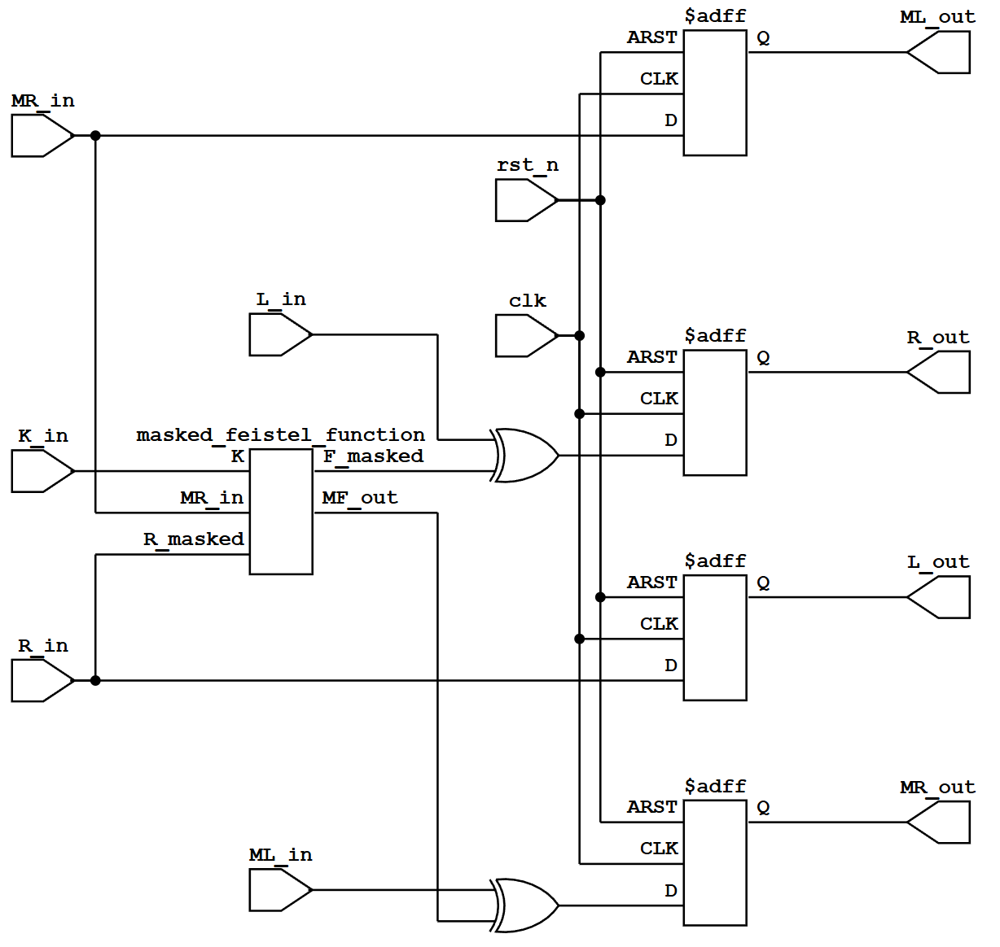

# Implementation of a 16-Stage Pipelined DES Hardware Accelerator with First-Order Boolean Masking for SCA Resilience

This project implements a high-performance 16-stage pipelined DES hardware accelerator with **side-channel attack (SCA) resilience**. The entire project is written in SystemVerilog, focusing not only on achieving extremely high throughput (outputting one 64-bit ciphertext per clock cycle) but also deeply integrating **first-order boolean masking** protection mechanisms at the hardware architecture level.



---

## Key Features

### 1. 16-Stage Pipeline
*   **Extreme Throughput**: Fully unfolds the 16 rounds of the DES algorithm, inserting pipeline registers between each round.
*   **Zero-Dead-Cycle Latency**: After an initial latency of 16 clock cycles, the system achieves a remarkable throughput of **one 64-bit ciphertext output per clock cycle**.
*   **Critical Path Optimization**: Each pipeline stage contains only a single Feistel operation and XOR logic. This significantly shortens the critical path, facilitating extremely high operating frequencies ($F_{max}$) on FPGAs or ASICs.

### 2. First-Order Boolean Masking
*   **Power Signature Decoupling**: To defend against side-channel attacks such as Differential Power Analysis (DPA), the system mixes a 64-bit random mask ($M_{in}$) at the very initial stage of plaintext input.
*   **Dual-Rail Data Flow**: Throughout the 16-stage pipeline, the true data $D$ never exists in plaintext form on any physical wire. All transmissions and computations flow synchronously along two parallel paths: the "masked data" ($D' = D \oplus M$) and the "mask value" ($M$).
*   **Re-masking**: Following the non-linear S-Box substitution, the system introduces a new mask value for re-masking, ensuring that power consumption noise across different rounds remains completely randomized. *(Note: In a physical chip implementation, this new mask must be dynamically provided by a True Random Number Generator (TRNG))*.

### 3. Pure Combinational Logic S-Boxes (Boolean Equation S-Boxes)
*   **ROM-Less Implementation**: Traditional DES designs often utilize Read-Only Memory (ROM) look-up tables to implement S-Boxes, which are prone to leakage in masked designs. This project implements all 8 S-Boxes entirely using **pure boolean combinational logic**.
*   **Gate-Level Mask Absorption**: Through synthesizer optimization, the mask decoding ($D' \oplus M_{in}$) and re-masking ($Q \oplus M_{out}$) operations are directly absorbed into the Look-Up Tables (LUTs). This guarantees that no unmasked intermediate transitional states appear on any FPGA routing node.

### 4. Parallel Key Schedule
*   Constructs the 16-round subkeys utilizing pure combinational logic.
*   Synchronously supplies the 48-bit subkeys to their corresponding pipeline stages, ensuring strict timing alignment.

---

## Project Structure

All project source code is located within the `src/` directory:

| File Name | Description |
| :--- | :--- |
| `des_top.sv` | **Top-Level Module**: Handles initial permutation (IP/IP_INV) for plaintext/ciphertext, masking initialization, and instantiates the 16-stage pipeline and key generator. |
| `des_round.sv` | **Round Stage Module**: Implements a single pipeline stage, including register latching logic to maintain synchronous flow of data and masks. |
| `feistel.sv` | **Masked Feistel Function**: Executes the Expansion (E), XOR with the subkey, S-Box substitution, and Permutation (P). |
| `sbox1.sv` ~ `sbox8.sv` | **Combinational Logic S-Boxes**: 8 independent S-Box modules, each integrating boolean operations for input/output masking. |
| `des_defines.vh` | **Hardware Constants & Permutations**: Utilizes `automatic function`s to implement IP, E, and P permutation matrices, avoiding array passing issues across different compilers. |
| `tb_des.sv` | **Simulation Testbench**: Used to verify pipeline timing and cryptographic correctness. |
| `Schematic.svg` | **RTL Schematic Diagram**: A visualization of the actual hardware netlist for a single round stage (`des_round_stage`), extracted via Yosys. |
| `Architecture.md` | **ASCII Architectural Diagram**: A text-based block diagram providing developers with a quick understanding of the data flow. |

---

## Simulation & Verification

This project supports **Icarus Verilog** (`iverilog`). The testbench includes NIST standard Known Answer Test (KAT) vectors to ensure absolute cryptographic correctness.

### Execution Steps

In an environment with Icarus Verilog installed, open a terminal in the project root directory and execute:

#### Verilog

```powershell
# Run the script
.\run_sim.ps1
```


```bash
# Compile all Verilog source files and specify tb_des as the top module
iverilog -g2012 -I src -s tb_des -o des_sim_v src/tb_des.v src/des_top.v src/des_round.v src/feistel.v src/sbox*.v src/lfsr.v


# Execute the simulation
vvp des_sim_v

# Open waveform with GTKWave
gtkwave ./dump.vcd
```

### Verification Vectors (NIST Standard Vectors)

The testbench automatically verifies the following vectors (accounting for the 16-cycle output latency):

| Test Case | Key | Plaintext | Expected Ciphertext |
| :--- | :--- | :--- | :--- |
| **Case 1** | `0123456789ABCDEF` | `4E6F772069732074` | `3FA40E8A984D4815` |
| **Case 2** | `133457799BBCDFF1` | `0123456789ABCDEF` | `85E813540F0AB405` |

---

## Security Note

This design features a complete "first-order boolean masking" framework. However, during simulator (`tb_des.sv`) testing, to ensure functional verification stability, we supply a fixed initial random mask (`64'hA5A5A5A55A5A5A5A`).

For actual tape-out or FPGA deployment in high-security environments:
1. **TRNG Integration**: The `mask_in` of `des_top` and the re-masking value `M_sbox_out` within `feistel.sv` **must** be connected to a high-quality **True Random Number Generator (TRNG)**.
2. **Synthesis Constraints**: When performing Logic Synthesis, synthesis constraints (e.g., `Keep Hierarchy` / `Don't Touch`) must be carefully configured to prevent the synthesis tool from optimizing out the security masking logic due to aggressive optimization strategies.
